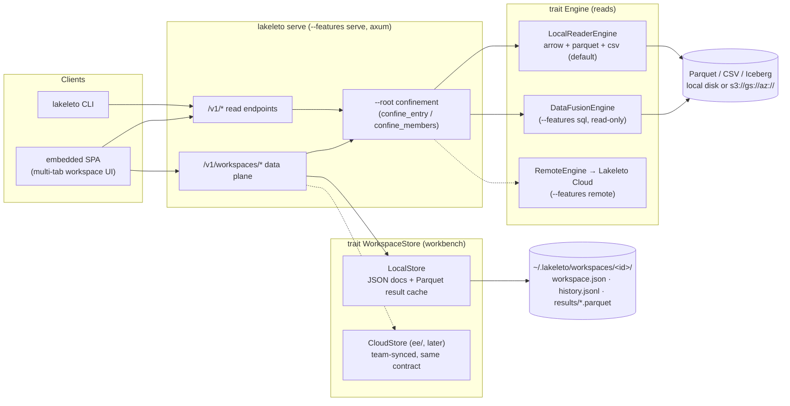
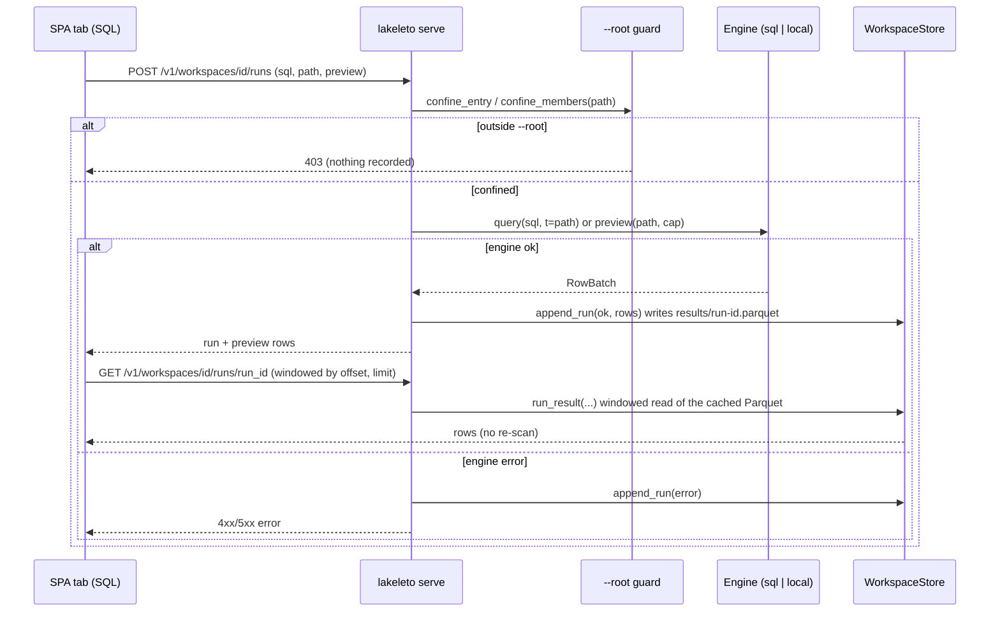
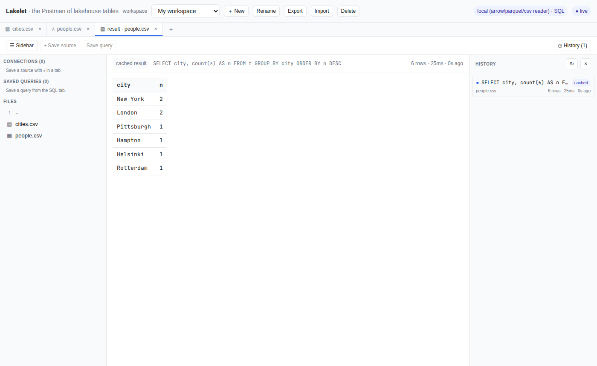
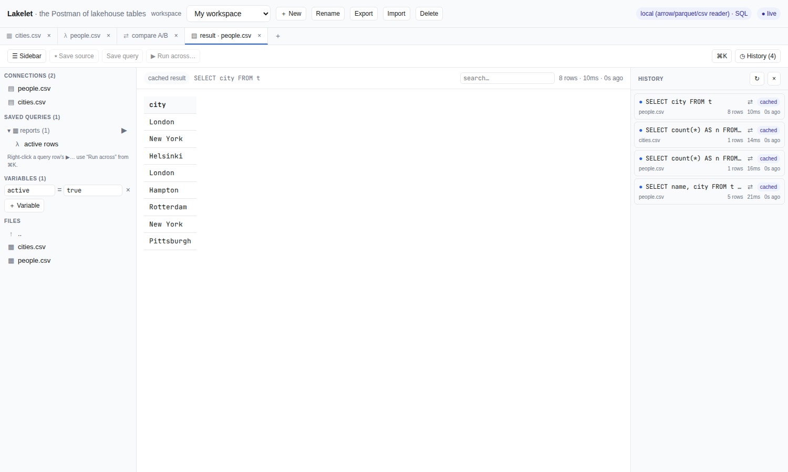

# Lakeleto

**Lakeleto — the Postman of lakehouse tables.** Point it at a `.parquet`, `.csv`, or `.tsv` and
see the schema, a clean row preview, and per-column profiles **near-instantly** — no signup, no
upload, no server, offline. A single static binary that runs on your laptop or inside a
locked-down CI runner. (`.tsv` is read tab-delimited; `--format tsv` forces it for any name.)

> **Status: v0.1.0 — MVP scaffold (lakeleto).** *Low-Med MVP, "fastest to lovable,"
> engine is a commodity → pure UX.* The MVP
> ships the lean, pure-Rust **local reader** engine (`arrow` + `parquet` + `csv`) behind a
> single [`Engine`](src/engine/mod.rs) trait, with `schema` / `head` / `profile` / `info`
> commands, table/JSON/NDJSON/CSV output, a virtualized-grid SPA (`--features serve`), an
> opt-in DataFusion **SQL** engine (`--features sql`, read-only), a self-contained **Iceberg**
> reader (`--features iceberg`), **BYO-credential `s3://`/`gs://`/`az://` reads**
> (`--features object-store`), and the **Lakeleto Cloud** engine seam (`--features
> remote`). Last updated 2026-07-13.

## Why it exists

No Rust tool owns "the Postman of lakehouse tables." The engine is a **commodity** —
DuckDB, Polars, DataFusion all read Parquet/CSV/Iceberg — so the value is entirely in the
**UX and packaging**: instant, offline, no-account inspection of columnar data sitting on
your disk (or, later, your cloud bucket with your own credentials).

## Architecture

Two load-bearing seams, both traits: [`Engine`](src/engine/mod.rs) carries **reads**, and
[`WorkspaceStore`](src/workspace.rs) carries the **workbench** (connections, saved queries,
run history + cached results). Everything above a seam binds only to the trait, so every
backend below it is swappable — including a hosted cloud one.



The workspace **run** flow — how a query becomes a history entry with a re-openable cached
result (failures are recorded too):



## Install

Prebuilt, signed binaries ship on every [release](https://github.com/lucheeseng827/lakeleto/releases) for **Linux** (x86_64/aarch64, static musl), **macOS** (Intel/Apple Silicon), and **Windows** (x86_64). Every artifact carries a cosign signature (`.sig`/`.pem`), a SHA256, and SLSA build provenance.

```bash
# cargo-binstall — fetches the right prebuilt binary for your platform (no compile)
cargo binstall lakeleto

# Homebrew (macOS + Linux)
brew install lucheeseng827/lakeleto/lakeleto   # or: brew tap lucheeseng827/lakeleto && brew install lakeleto

# Docker (linux/amd64 + linux/arm64, distroless)
docker run --rm -p 8080:8080 -v "$PWD:/data:ro" mancube/lakeleto serve --addr 0.0.0.0:8080 --root /data

# from source
cargo install lakeleto --features serve,sql,iceberg,object-store
```

**Windows:** `cargo binstall lakeleto` pulls the `x86_64-pc-windows-msvc` zip automatically. Or download `lakeleto-x86_64-pc-windows-msvc.zip` from the release, unzip, and run `lakeleto.exe` — a single static executable, no install step.

## Running it — step by step (no terminal experience needed)

Lakeleto is **one self-contained program** — no installer, no account, nothing to configure. The friendliest way in is `lakeleto open <your file>`: it starts the local viewer and **opens your web browser automatically**. Everything runs on your own machine; your data is never uploaded.

> **Double-clicking the file won't work.** Lakeleto is a command-line program — if you double-click it, a black window flashes and closes. You run it by typing one short command in a terminal, as shown below. It only takes a minute.

### Windows

1. Download **`lakeleto-x86_64-pc-windows-msvc.zip`** from the [latest release](https://github.com/lucheeseng827/lakeleto/releases/latest).
2. In your Downloads folder, **right-click the zip → Extract All**. You now have a folder containing `lakeleto.exe`.
3. **Open a terminal in that folder:** open the folder, click the address bar at the top, type `powershell`, and press **Enter**. A blue terminal window opens, already pointed at the folder.
4. **Open a data file** (drag your `.parquet` / `.csv` / `.tsv` file onto the terminal to paste its full path):
   ```powershell
   .\lakeleto.exe open "C:\Users\you\Downloads\yourfile.parquet"
   ```
   Your browser opens with the table loaded. **Or browse a whole folder** at http://127.0.0.1:8080:
   ```powershell
   .\lakeleto.exe serve --root "C:\Users\you\Documents\data"
   ```
5. **First run:** Windows SmartScreen may warn "Windows protected your PC / unknown publisher." Click **More info → Run anyway**. (The download is cosign-signed and ships a `.sha256` you can verify.)
6. **To stop it:** click the terminal and press **Ctrl + C**.

### macOS

1. `brew install lucheeseng827/lakeleto/lakeleto` — or download the `…apple-darwin.tar.gz` (Apple Silicon = `aarch64`, older Intel Macs = `x86_64`) and double-click it to unpack `lakeleto`.
2. Open **Terminal** (Spotlight → type "Terminal"). Type `lakeleto ` (or drag the unpacked `lakeleto` file in), then `open `, then drag your data file in, and press **Enter**:
   ```bash
   lakeleto open ~/Downloads/yourfile.parquet      # browser opens automatically
   lakeleto serve --root ~/Documents/data          # or browse a folder at http://127.0.0.1:8080
   ```
3. **First run:** if macOS blocks it ("cannot verify the developer"), right-click the `lakeleto` file in Finder → **Open** once, or run `xattr -d com.apple.quarantine ./lakeleto`.

### Linux

```bash
tar xzf lakeleto-x86_64-unknown-linux-musl.tar.gz    # -> ./lakeleto
./lakeleto open yourfile.parquet                     # opens your browser
./lakeleto serve --root ~/data                        # or browse a folder at http://127.0.0.1:8080
```

### Once it's open in the browser

Point at a file or a folder and you get, with no setup:

- **Grid** — scroll the rows; type in a column's **filter** box (substring by default, or prefix `>` `<` `>=` `<=` `=` `!=` for comparisons); click a header to **sort**; click a cell to copy it; click a row for full **Row detail**.
- **Schema** — every column, its type, nullability, and the exact row count.
- **Profile** — per-column null %, distinct count, min/max, and sample values.
- **SQL** — run read-only `SELECT …` over the table (the current file is the table `t`).
- **Export / Download view** — save the current (filtered/sorted) view as CSV, JSON, or Parquet.

Stop the server anytime with **Ctrl + C** in the terminal.

## Command-line reference

For scripting and pipelines, every view is also a one-shot command (no server, prints to stdout):

```bash
# (paths below are relative to this module dir: .)
# schema — columns, types, nullability (+ exact row count for Parquet, from the footer)
cargo run --bin lakeleto -- schema  examples/people.csv

# preview the first N rows
cargo run --bin lakeleto -- head    examples/people.csv -n 5

# per-column profile: null %, distinct, min/max, samples (bounded scan)
cargo run --bin lakeleto -- profile examples/people.csv

# --fast: near-instant profile from the Parquet footer statistics — no row scan, so
# nulls / min / max are exact over the WHOLE file (distinct + samples aren't computed)
cargo run --bin lakeleto -- profile --fast data.parquet

# point it at a DIRECTORY of .parquet files (a `foo.parquet/part-*` split or Hive-partitioned
# subdirs) to read them as one table — columns are unioned across files, sidecars ignored, and
# Hive `key=value` dir names (e.g. year=2024/month=03) become extra columns
cargo run --bin lakeleto -- schema dataset.parquet/

# quick info + which engines this binary has
cargo run --bin lakeleto -- info    examples/people.csv
cargo run --bin lakeleto -- engines

# pipe-friendly output
cargo run --bin lakeleto -- head examples/people.csv -o json
```

SQL is an **opt-in** upgrade (heavy DataFusion build stays out of the default binary):

```bash
cargo run --features sql --bin lakeleto -- \
  query "SELECT city, count(*) n, avg(score) avg_score FROM t GROUP BY city ORDER BY n DESC" \
  --file examples/people.csv
```

## The backend + UI: `lakeleto serve` / `lakeleto open`

`lakeleto serve` exposes every `Engine` operation over HTTP **and** serves an embedded
single-page UI (bundled into the binary via `rust-embed`, so it works air-gapped). This is
the contract the localhost SPA calls **and** the same one the `RemoteEngine` (Lakeleto
Cloud) client speaks, so the endpoint surface is fixed before either is built. Opt-in behind
`--features serve` (add `sql` for `POST /v1/query`):

```bash
# start the server + UI at http://127.0.0.1:8080
cargo run --features serve,sql --bin lakeleto -- serve

# …or open a file straight in the UI (starts the server, launches a browser tab)
cargo run --features serve,sql --bin lakeleto -- open examples/people.csv
```

The UI (`frontend/dist/index.html`, vanilla JS — no build step) is a **virtualized data
grid** with a file browser, click-to-sort, per-column filters, column resize/reorder/hide,
click-to-copy cells, and export, plus Schema / Profile / SQL tabs. The grid renders only the
visible rows over a spacer sized to the total, fetching windows from `/v1/rows` on scroll — so
it browses larger-than-memory Parquet. Hiding/reordering columns pushes a projection (`cols=`)
so the fetch and the download match what's on screen. Non-API routes fall back to the SPA;
`/v1/*` misses return `404` JSON.



The multi-tab workbench: saved queries, per-tab variables, run history, and multiple
connections — every query cached to a re-openable result.



| Method | Path | Purpose |
|--------|------|---------|
| `GET`  | `/healthz` | liveness |
| `GET`  | `/v1/engines` | serving engine capabilities + endpoint list |
| `GET`  | `/v1/schema?path=&format=` | columns, types, nullability, row count |
| `GET`  | `/v1/info?path=&format=` | format, engine, size, rows, columns |
| `GET`  | `/v1/preview?path=&limit=&format=` | first N rows as `{ columns, rows }` |
| `GET`  | `/v1/profile?path=&scan=&format=` | per-column null %, distinct, min/max (`scan=0` = footer-stats fast path for Parquet) |
| `GET`  | `/v1/rows?path=&offset=&limit=&sort=&desc=&filter=col:op:value&cols=a,b` | grid window (filter → sort → page → project) |
| `GET`  | `/v1/stats?path=&filter=col:op:value` | column profile over the **filtered** view |
| `GET`  | `/v1/export?path=&fmt=csv\|json\|parquet&sort=&filter=&cols=` | current view as a download |
| `GET`  | `/v1/list?dir=` | file browser: subdirs + readable data files |
| `POST` | `/v1/query` | `{ sql, file?, tables[] }` → `{ columns, rows }` (needs `sql`) |

Filter ops: `eq ne lt le gt ge contains` (or `= != < <= > >= ~`). With the `sql` feature, any
sort/filter scan is **pushed into DataFusion** (`WHERE` / external `ORDER BY` / `LIMIT`/`OFFSET`
+ exact `count(*)`) — correct and unbounded. Without it, the local reader sorts/filters with
Arrow kernels over a bounded working set (`scan_cap`, default 200k rows); the response's
`bounded` flag then marks a partial view for a very large file.

```bash
curl 'localhost:8080/v1/schema?path=examples/people.csv'
curl 'localhost:8080/v1/profile?path=examples/people.csv'
curl -sX POST localhost:8080/v1/query -H 'content-type: application/json' \
  -d '{"sql":"SELECT city, count(*) n FROM t GROUP BY city","file":"examples/people.csv"}'
```

Errors return `{ "error": ... }` with a mapped status (`400` bad request/format, `404` not
found, `501` when a needed feature — e.g. `sql` — wasn't compiled in).

**Bearer auth (before you expose it).** `--token <TOKEN>` (or `LAKELETO_TOKEN`) gates every
`/v1/*` route behind `Authorization: Bearer <TOKEN>` (or a `?token=` query param, for browser
downloads/deep-links); `/healthz` and the SPA stay open so the page can load. The token is
constant-time compared. `lakeleto open`/`lakeleto serve` print/launch the URL with the token attached,
and the SPA sends it on every request. Binding to a non-loopback address without a token
prints a warning.

> **Prefer the header.** The `?token=` query param is a convenience for the loopback browser
> flow — but a token in a URL can leak through browser history, shell history, and proxy/access
> logs. Use the `Authorization` header for scripts and anything non-local; treat `?token=` as
> loopback-only.

```bash
# generate a token, keep it in a variable, and run the server in the background:
TOKEN="$(openssl rand -hex 16)"
lakeleto serve --token "$TOKEN" &          # serves on http://127.0.0.1:8080/
curl -H "Authorization: Bearer $TOKEN" 'localhost:8080/v1/schema?path=examples/people.csv'
```

## Sits next to your cloud data: `s3://` / `gs://` / `az://` (BYO credentials)

Point Lakeleto at a table in an object store and it reads it **with your own credentials and
zero hosted compute** — nothing is uploaded, no Lakeleto server is involved, the bytes go
straight from your bucket to your machine. Opt-in behind `--features object-store`:

```bash
# credentials come from the environment, exactly as the cloud SDKs expect them:
export AWS_ACCESS_KEY_ID=…  AWS_SECRET_ACCESS_KEY=…  AWS_REGION=us-east-1
cargo run --features object-store --bin lakeleto -- schema s3://my-bucket/events.parquet
cargo run --features object-store --bin lakeleto -- head   gs://my-bucket/events.parquet -n 20

# browse a bucket prefix in the UI, same grid as local disk:
cargo run --features serve,object-store --bin lakeleto -- serve
curl 'localhost:8080/v1/list?dir=s3://my-bucket/warehouse/'
```

Recognised schemes: `s3://` (`s3a://`), `gs://` (`gcs://`), `az://` (`azure://`/`abfs[s]://`/
`adl://`). Credentials are read from the environment and nowhere else (`AWS_ACCESS_KEY_ID` /
`AWS_SECRET_ACCESS_KEY` / `AWS_REGION` / `AWS_ENDPOINT` / `AWS_SESSION_TOKEN`,
`GOOGLE_APPLICATION_CREDENTIALS` / `GOOGLE_SERVICE_ACCOUNT`, `AZURE_STORAGE_ACCOUNT_NAME` /
`AZURE_STORAGE_ACCOUNT_KEY`); S3-compatible stores (MinIO, R2) work via `AWS_ENDPOINT`.
**Remote Parquet is read with ranged requests** (only the footer + the row groups a window
touches), so it stays larger-than-memory just like local files; CSV is fetched whole. Every
`Engine` op — `schema`/`head`/`profile`/grid/`export`/browse — works over a remote URI for
free. Build without the feature and a URI gets a clear "rebuild with `--features
object-store`" message rather than a filesystem error.

## The one idea: an `Engine` trait

Because the engine is a commodity, everything is built around a single trait
([`src/engine/mod.rs`](src/engine/mod.rs)) and the (future) UI binds only to
`Box<dyn Engine>`:

| Backend | Feature | Reads | SQL | Role |
|---------|---------|-------|-----|------|
| `LocalReaderEngine` | *(default)* | Parquet, CSV | — | lean, pure-Rust MVP engine; compiles in seconds |
| `DataFusionEngine` | `sql` | Parquet, CSV | ✅ (read-only) | the SQL power engine |
| `RemoteEngine` | `remote` | server-defined | ✅ | the **Lakeleto Cloud** seam |
| Iceberg reader | `iceberg` | Iceberg | — | self-contained (metadata + Avro manifests → Parquet); merge-on-read **positional + equality deletes** (sequence-number aware), compressed manifests, **schema evolution** (field-id match/cast/null-fill), **statistics/partition pruning** (skip files by manifest bounds) |
| Object-store reads | `object-store` | remote Parquet/CSV (`s3://`/`gs://`/`az://`) | — | the local engine over your bucket with your own creds; ranged Parquet, zero hosted compute |

**Which engine does the UI get built on first? The local one.** The hosted engine is *not* a
separate product — it is one more `Engine`, added later, behind the same trait. That is a
deliberate, adversarially-reviewed design decision.

## Design principles

- **Lean by default.** `cargo build -p lakeleto` pulls only `arrow`/`parquet`/`csv` — no
  C++ toolchain, no async runtime, no server. Heavy engines are off-by-default features
  (same pattern as `module_52/edgeguard-ner`'s `onnx` gate). Arrow/Parquet are constrained to
  the **58** major line and DataFusion to **54** (semver `"58"`/`"54"`, i.e. the major line,
  not an exact pin), in lockstep with `module_62`, so one Arrow major lives in the workspace.
- **Headless-first.** The CLI is the scriptable surface the desktop UI (Phase 2) is built
  on top of — both bind to the same trait, so `lakeleto schema` and the UI can never diverge.
- **Read-only.** `lakeleto query` rejects anything that isn't a `SELECT`/`WITH`/`EXPLAIN`
  (guard ported from `module_62`). An explorer never mutates your data.
- **Your data stays yours.** Local reads never touch the network. Object-store reads
  (`--features object-store`) use *your own* credentials with zero hosted compute — the bytes
  go bucket→machine, nothing is uploaded. The remote *engine* is opt-in and explicitly a
  *optional seam*, not a default.

## Layout

```
lakeleto/
├── Cargo.toml                     # lean default; sql/remote/iceberg are opt-in features
├── src/
│   ├── main.rs                    # `lakeleto` binary
│   ├── lib.rs                     # crate root + re-exports
│   ├── cli.rs                     # clap surface: schema/head/profile/info/engines/query/serve/open
│   ├── source.rs                  # format detection (directory shape → extension → magic bytes; s3:// URIs)
│   ├── render.rs                  # table / json / ndjson / csv output
│   ├── api.rs                     # `lakeleto serve` HTTP/JSON API + embedded SPA (feature: serve)
│   ├── iceberg.rs                 # self-contained Iceberg reader (feature: iceberg)
│   ├── objstore.rs                # BYO-credential s3://,gs://,az:// reads (feature: object-store)
│   ├── error.rs                   # one error type across the trait seam
│   └── engine/
│       ├── mod.rs                 # the Engine trait + shared schema/profile helpers
│       ├── local.rs               # LocalReaderEngine (default)
│       ├── sql.rs                 # DataFusionEngine (feature: sql)
│       └── remote.rs              # RemoteEngine — Lakeleto Cloud seam (feature: remote)
├── frontend/dist/index.html       # the embedded SPA shell (rust-embed; build-step-free)
└── examples/people.csv
```

## Roadmap

The seam and the local engine (Phase 0–1) are in, and the UI, SQL, Iceberg reader, and
object-store reads have all landed behind the trait. Next is hardening and polish of that
shipped surface; the hosted **Lakeleto Cloud** plane remains future work.
